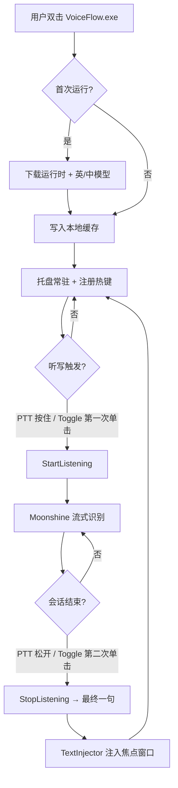

# Design Doc: VoiceFlow（Windows 版）

面向非开发者的本地语音听写桌面应用，行为对标 Whisper Flow：通过热键触发听写，在按键结束（松开或再次切换）后将**最终一句**识别文字注入当前焦点应用。

---

## 1. 产品定位

| 维度 | 说明 |
| ---- | ---- |
| 产品名 | **VoiceFlow** |
| 核心功能 | 麦克风拾音 → 本地 ASR → **向焦点窗口输入文字** |
| 目标平台 | Windows 11 x64（后续可扩展 macOS/Linux） |
| 运行方式 | 后台托盘常驻；**无浏览器** |
| 推理 | 本地推理，无云端 API；模型首次启动时下载 |
| 语言 | 英文 + 中文（用户可选主语言，可切换） |
| 硬件 | 优先 GPU（ONNX Runtime CUDA EP）；无 GPU 时自动回退 CPU |
| 分发对象 | 非开发者（需安装包/单文件、可签名、少依赖） |
| 开源协议 | MIT（组件均为开源许可） |

### 1.1 MVP 范围（明确边界）

**包含：**

- 系统托盘图标 + 右键菜单（开始/暂停、语言、设置、退出）
- 全局热键，**两种模式均支持**（设置页可切换）：
  - **Push-to-talk**：按住热键录音，松开后识别并注入
  - **Toggle**：单击开始录音，再单击结束并注入
- 焦点窗口文字注入：仅在会话结束时注入**最终一句**（`SendInput` 主路径，剪贴板粘贴回退）
- 首次启动向导：下载运行时组件 + 语言模型（英文、中文各一套）
- 设置页：热键、语言、GPU/CPU、麦克风设备

**不包含（Phase 2+）：**

- 导出 `.txt` / `.srt`
- 说话人分离、文件转写、摘要
- macOS / Linux

---

## 2. 体积预算与可行性（重要）

### 2.1 目标：单文件 `.exe` < 20 MB？

**结论：在「本地双语 ASR + GPU/CPU 推理」前提下，不可行。**

| 组件 | 典型体积 | 能否打进 20 MB exe |
| ---- | -------- | ------------------ |
| 应用壳（托盘、热键、文字注入、设置 UI） | 2–8 MB | ✅ |
| ONNX Runtime（CPU） | ~12–18 MB | ❌ 单项已接近上限 |
| ONNX Runtime（含 CUDA EP） | ~80–150 MB+ | ❌ |
| Moonshine 原生库（`moonshine` + tokenizer 等） | ~5–15 MB | ⚠️ |
| **运行时合计（不含模型）** | **~25–50 MB（CPU）** / **~100 MB+（GPU）** | ❌ |
| 英文模型（Tiny Streaming） | ~30 MB | 可首次下载 ✅ |
| 中文模型（Mandarin Base） | ~70 MB | 可首次下载 ✅ |

说明：

- Moonshine **模型**可首次下载（你已接受），但 **推理运行时** 仍须随应用分发或二次下载。
- `moonshine-voice` Python 轮子单独约 **80 MB**，若走 Python + PyInstaller，单 exe 通常 **150 MB–500 MB+**，与 20 MB 目标相差一个数量级。
- Moonshine 官方亦建议 Windows 生产环境使用 **C++ 绑定**，而非 Python 原型栈。

### 2.2 已确认分发策略

采用 **「小体积引导程序 + 首次下载运行时包」**（已确认可接受），对用户仍呈现为「下载一个 VoiceFlow.exe 就能用」：

```
VoiceFlow.exe          (~8–15 MB)   托盘壳 + 热键 + 文字注入 + 下载器/更新器
        │
        ├─ 首次启动下载 ─► runtime-cpu.zip   (~35–45 MB)   onnxruntime + moonshine DLL
        │                  或 runtime-gpu.zip (~90–120 MB)  含 CUDA EP（检测到 NVIDIA 时推荐）
        │
        └─ 首次启动下载 ─► model-en-tiny-streaming.zip  (~30 MB)
                           model-zh-base.zip             (~70 MB)
```

**用户感知：**

1. 双击 `VoiceFlow.exe`（体积小）
2. 向导提示「正在准备语音引擎…」（一次性，需联网）
3. 完成后托盘常驻，即可听写

**明确排除：** 不使用 Windows 内置语音识别（SAPI / Win+H 等）作为 ASR 引擎；统一走 Moonshine 本地推理。

### 2.3 体积目标

| 指标 | 目标 |
| ---- | ---- |
| 用户下载的初始文件 | **≤ 15 MB** 单 exe（引导程序） |
| 首次运行后磁盘占用 | **~150–250 MB**（CPU 路径 + 英/中模型） |
| GPU 路径额外占用 | **+50–100 MB**（CUDA 运行时包） |

---

## 3. 技术选型（修订）

### 3.1 语音识别：Moonshine Voice（C++ 路径）

| 项目 | 选择 |
| ---- | ---- |
| SDK | Moonshine C++ API + 预编译 Windows x64 库 |
| 英文模型 | `Tiny Streaming`（低延迟，~30 MB） |
| 中文模型 | `Mandarin Base`（官方有独立中文模型，~70 MB） |
| 推理后端 | ONNX Runtime；启动时探测 GPU，有则 `CUDAExecutionProvider`，否则 `CPUExecutionProvider` |
| 不推荐 MVP 使用 | Python `moonshine-voice` + Streamlit（体积大、非原生、不适合文字注入） |

**API 要点（与旧稿不同）：**

- 使用 `Transcriber` / `MicTranscriber`，非虚构的 `MoonshineSTT`
- 通过 `get_model_for_language("en")` / `get_model_for_language("zh")` 解析模型路径
- 用 **Transcript 事件回调** 获取最终文本行，而非逐帧 `transcribe(bytes)`
- 麦克风由 `MicTranscriber` 内部通过 WASAPI / `sounddevice` 处理；**无需** 自写 `pyaudio` 采集器

### 3.2 桌面壳：原生 Windows（无浏览器）

| 层级 | 技术 | 理由 |
| ---- | ---- | ---- |
| **MVP 推荐** | **C++17 + Win32**（托盘、热键、设置对话框） | 体积最小；与 Moonshine C++ 示例一致；易静态链接壳层 |
| 备选 | C# WPF + P/Invoke Moonshine | 开发更快，但 exe + 依赖通常更大 |
| 不推荐 MVP | PyQt6 / Tauri + React / Streamlit | 体积与打包复杂度高，偏离 20 MB 方向 |

### 3.3 文字注入（Whisper Flow 核心行为）

| 方式 | 说明 |
| ---- | ---- |
| 主路径 | `SendInput` 模拟 Unicode 键盘输入，逐字符或逐词注入焦点控件 |
| 回退路径 | 复杂控件（部分 IDE、富文本）失败时：写入剪贴板 + `Ctrl+V` |
| 注意事项 | 需保存/恢复剪贴板；检测前台窗口；可选末尾自动加空格/标点 |

### 3.4 全局热键（双模式）

| 模式 | 触发 | 结束 | 注入时机 |
| ---- | ---- | ---- | -------- |
| **Push-to-talk**（默认） | 按住热键 | 松开热键 | 松开后注入最终一句 |
| **Toggle** | 单击热键 | 再单击同一热键 | 第二次单击后注入最终一句 |

实现要点：

- Push-to-talk 需低级键盘钩子（`WH_KEYBOARD_LL`）以检测按住/松开；Toggle 可用 `RegisterHotKey`
- 默认热键：`Ctrl+Shift+Space`（可在设置中自定义）
- 设置页提供「热键模式」下拉：Push-to-talk / Toggle
- 录音中托盘图标变色 / 气泡提示；**MVP 不做流式逐字注入**

---

## 4. 项目结构（修订）

```
voiceflow/
├── README.md
├── LICENSE
├── src/
│   ├── main.cpp                 # 入口：单实例、托盘、消息循环
│   ├── tray/
│   │   └── tray_icon.cpp        # Shell_NotifyIcon、菜单
│   ├── hotkey/
│   │   ├── global_hotkey.cpp    # RegisterHotKey / hook
│   │   └── hotkey_mode.cpp      # Push-to-talk vs Toggle 状态机
│   ├── inject/
│   │   └── text_injector.cpp    # SendInput + 剪贴板回退
│   ├── asr/
│   │   ├── moonshine_session.cpp # Transcriber / MicTranscriber 封装
│   │   └── backend_select.cpp   # GPU/CPU EP 选择
│   ├── setup/
│   │   ├── first_run_wizard.cpp # 首次下载向导
│   │   └── component_cache.cpp  # 运行时与模型缓存路径
│   └── ui/
│       └── settings_dialog.cpp  # 热键、语言、设备、推理设备
├── third_party/
│   └── moonshine/               # 由 download-lib 脚本拉取，不提交 git
├── packaging/
│   ├── build_release.ps1        # MSBuild + 资源打包
│   └── voiceflow.iss            # Inno Setup（可选：生成安装程序）
└── doc/
    └── DESIGN_DOC.md
```

---

## 5. 核心模块设计

### 5.1 `asr/moonshine_session` — 识别会话

**职责：** 管理 `MicTranscriber` 生命周期，在热键按下/松开时 start/stop，通过 listener 拿到最终一句文本。

```cpp
// 伪代码 — 对齐 Moonshine 真实 API
class MoonshineSession {
 public:
  bool Init(const std::wstring& language_code);  // "en" | "zh"
  void StartListening();
  void StopListening();
  void SetOnFinalLine(std::function<void(std::wstring)> cb);

 private:
  std::unique_ptr<MicTranscriber> transcriber_;
  std::wstring model_path_;
  int model_arch_;
};
```

**策略（已确认：仅注入最终一句）：**

- **Push-to-talk**：热键按下 → `StartListening()`；松开 → `StopListening()` → 等待 `on_line_complete` → `TextInjector::Inject()`
- **Toggle**：第一次单击 → `StartListening()`；第二次单击 → `StopListening()` → 同上注入流程
- 语言切换时重新 `Init()` 并加载对应模型目录
- 流式中间结果仅可用于托盘 tooltip 状态提示；**不写入焦点窗口**

### 5.2 `inject/text_injector` — 焦点文字注入

```cpp
class TextInjector {
 public:
  bool Inject(const std::wstring& text);
 private:
  bool TrySendInput(const std::wstring& text);
  bool TryClipboardPaste(const std::wstring& text);
};
```

### 5.3 `setup/first_run_wizard` — 首次运行

**检查项：**

1. `%LOCALAPPDATA%\VoiceFlow\runtime\` 是否存在且 DLL 完整
2. 英文 / 中文模型目录是否存在
3. VC++ Redistributable 是否已安装（缺失时提示安装）

**下载源：** Moonshine 官方 model URL + 自建 CDN/ GitHub Release 托管 `runtime-*.zip`

### 5.4 `asr/backend_select` — GPU / CPU 回退

```
启动 → 检测 NVIDIA GPU + CUDA 驱动
  ├─ 有 → 加载 runtime-gpu（CUDA EP）
  └─ 无 → 加载 runtime-cpu（CPU EP）
设置页允许用户强制 CPU（省电 / 兼容性）
```

---

## 6. 交互流程



---

## 7. 分发与非开发者体验

| 项目 | 要求 |
| ---- | ---- |
| 交付物 | 单文件 `VoiceFlow.exe`（引导程序）；可选 Inno Setup 安装包 |
| 代码签名 | 强烈建议 Authenticode 签名，降低 SmartScreen 拦截 |
| 依赖 | 捆绑或引导安装 VC++ 2015–2022 x64 Redistributable |
| 单实例 | 互斥量防止多开 |
| 自动更新 | Phase 2；MVP 仅手动下载新版本 |
| 卸载 | 删除 `%LOCALAPPDATA%\VoiceFlow` + 移除启动项 |

---

## 8. 依赖清单（修订）

**不随 repo 提交，由构建/首次运行拉取：**

- Moonshine Windows x64 库（`download-lib.bat` / GitHub Release）
- `onnxruntime.dll`（CPU 或 GPU 变体）
- 模型：`en` Tiny Streaming、`zh` Mandarin Base

**构建机依赖：**

- Visual Studio 2022（C++ 桌面开发）
- Windows 11 SDK
- CMake 3.22+（可选）

**已移除（相对旧稿）：**

- `streamlit`、`pyaudio`、`webrtcvad`、Python 虚拟环境
- 虚构的 `MoonshineSTT` Python 封装

---

## 9. MVP 搭建步骤（Cursor 操作指南）

| 步骤 | 操作 |
| ---- | ---- |
| 1 | 从 Moonshine 拉取 `examples/windows/cli-transcriber` 作为 ASR 参考工程 |
| 2 | 新建 Win32 托盘项目，验证单实例 + 热键 |
| 3 | 集成 `MicTranscriber`，控制台打印识别结果 |
| 4 | 实现 `TextInjector`，在 Notepad 中验证注入 |
| 5 | 串联：热键 → 识别 → 注入 |
| 6 | 实现首次运行下载器与英/中模型切换 |
| 7 | GPU/CPU 后端探测与设置页 |
| 8 | Release 构建 + 压缩壳层，目标初始 exe ≤ 15 MB |

预计 MVP：**1–2 周**（含打包与非开发者测试），显著高于旧稿「Streamlit 1–2 小时」估算。

---

## 10. 已确认产品决策

| 决策项 | 结论 |
| ------ | ---- |
| ASR 引擎 | Moonshine 本地推理；**不使用** Windows 内置语音 API |
| 分发形态 | 小体积初始 `VoiceFlow.exe` + 首次运行下载运行时与模型 |
| 热键交互 | **Push-to-talk** 与 **Toggle** 均支持，设置页可切换 |
| 文字注入 | 仅在会话结束时注入**最终一句**；不做流式逐字注入 |
| 默认热键模式 | Push-to-talk |

---

## 11. 风险与缓解

| 风险 | 缓解 |
| ---- | ---- |
| 首次运行需联网 | 向导明确提示；支持断点续传 |
| 中文 Moonshine Base CER 偏高（~25%） | MVP 先交付；Phase 2 评估更大中文模型或替代引擎 |
| `SendInput` 对部分应用无效 | 剪贴板回退 + 维护已知问题列表 |
| GPU 包体积大 | 默认仅下载 CPU；检测到 NVIDIA 再提示下载 GPU 加速包 |
| Toggle / PTT 热键冲突 | 设置页校验热键组合；文档说明两种模式差异 |
| Moonshine C++ API 变更 | 锁定依赖版本；以官方 `cli-transcriber` 示例为基线 |

---
